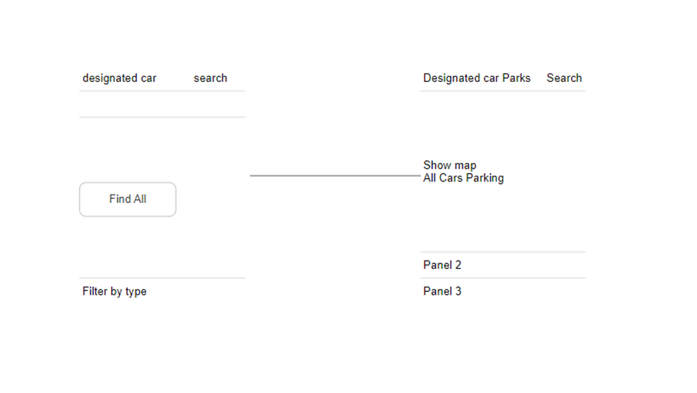

• A search bar at the top of the page, where users can enter a location to find car parks
• A map of the area, with car parks highlighted
• A list of car parks, including their name, address, distance from the user's location, and price (if available)
• Photos of the car parks
• Information about the car parks, such as the number of spaces available, the hours of operation, and whether or not they offer amenities such as disabled parking or electric vehicle charging(if information available)
