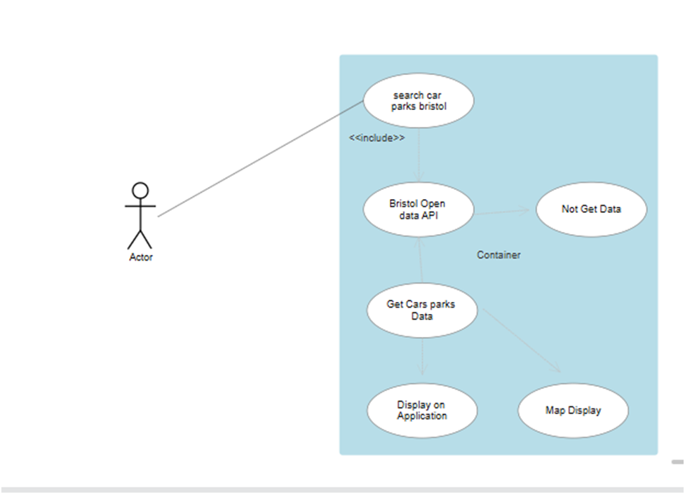

Software Requirements Specification (SRS):
• Functional Requirements:
o The application shall provide a search bar for users to enter car park names or keywords.
o The application shall fetch data from the Bristol Open Data API based on the search query.
o The application shall display a list of matching car parks with their names.
o (Future) The application shall display additional car park details upon selection (address, type etc.).
• Non-Functional Requirements:
o The application shall have a user-friendly and responsive interface.
o The application shall load search results within a reasonable timeframe.
o The application shall be compatible with major web browser

Developed Use Case Table
Use case ID Use case Name Use case Description
UC-01 Find All Cars- Parking Allows the user to see all the car parks
UC-02 Search by Location- Allows the user to search for car parks by entering a location.
UC-03 Search by Type- Enables the user to search for car parks based on type.
UC-03 View Search Results- Displays a list of designated car parks based on the search.

UC-01: Find All Car Parks
Actors: Driver
Preconditions: User has access to the web application.
Trigger: User opens the application.
Normal Flow:
• The application fetches all available car park data from the Bristol Open Data API.
• The application parses the JSON response and extracts relevant car park information (e.g., name, location).
• The application displays a list of all designated car parks with their names.
Alternative Flows:
• API error: The application displays an error message if the API request fails.
Postconditions: The user is presented with a list of all designated car parks or an appropriate error message.

UC-02: Search by Location
Actors: Driver
Preconditions: User has access to the web application.
Trigger: User enters a location in the search bar.
Normal Flow:
• The application sends the search query with location information to the Bristol Open Data API.
• The API retrieves and returns car park data matching the location criteria.
• The application parses the JSON response and displays a list of matching car parks with their names.
Alternative Flows:
• No results found: The application displays a message indicating no car parks match the search location.
• API error: The application displays an error message if the API request fails.
Postconditions: The user is presented with a list of car parks matching the location search or an appropriate error message.

UC-03: Search by Type
Actors: Driver
Preconditions: User has access to the web application.
Trigger: User selects a car park type (e.g., on-street, off-street) from a dropdown menu or filter option.
Normal Flow:
• The application sends the search query with the selected car park type to the Bristol Open Data API.
• The API retrieves and returns car park data matching the type criteria.
• The application parses the JSON response and displays a list of matching car parks with their names.
Alternative Flows:
• No results found: The application displays a message indicating no car parks match the selected type.
• API error: The application displays an error message if the API request fails.
Postconditions: The user is presented with a list of car parks matching the selected type or an appropriate error message.

UC-04: View Search Results
Actors: Driver
Preconditions: User has performed a search (by location, type, or all car parks).
Trigger: User clicks on a specific car park name in the search results list.
Normal Flow:
• The application retrieves additional details about the selected car park from the API (if available).
• The application displays a detailed view of the selected car park, potentially including information like address, type, and any additional data provided by the API.
Alternative Flows:
• API error: The application displays an error message if retrieving detailed information fails.
Postconditions: The user is presented with a detailed view of the selected car park or an appropriate error message.
