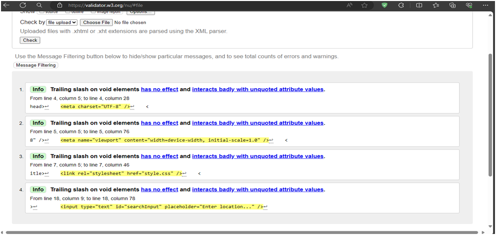

Black Box Testing

Test Case 1: Find All Car Parks
Description: Verify that the application displays a list of all designated car parks upon opening.
Steps:

1. Open the web application.
2. Observe the displayed content.
   Expected Result: A list of car park names is displayed.

Test Case 2: Search by Valid Location
Description: Test that the application retrieves and displays car parks matching a valid location search term.
Steps:

1. Enter a valid location (e.g., street name) in the search bar.
2. Click the search button.
3. Observe the displayed results.
   Expected Result: A list of car parks matching the location is displayed.

Test Case 3: Search by Invalid Location
Description: Verify that the application handles an invalid location search term gracefully.
Steps:

1. Enter an invalid location (e.g., random characters) in the search bar.
2. Click the search button.
3. Observe the displayed results.
   Expected Result: An appropriate message indicating no results are found is displayed.

Test Case 4: Search by Valid Car Park Type
Description: Test that the application retrieves and displays car parks matching a selected car park type.
Steps:

1. Select a valid car park type (e.g., on-street) from the filter options.
2. Click the search button.
3. Observe the displayed results.
   Expected Result: A list of car parks matching the selected type is displayed.

Test Case 5: Search by Invalid Car Park Type
Description: Verify that the application handles an invalid car park type selection gracefully.
Steps:

1. Select an invalid car park type (e.g., nonsensical value) from the filter options.
2. Click the search button.
3. Observe the displayed results.
   Expected Result: An appropriate message indicating an invalid selection is displayed.

Test Case 6: View Car Park Details
Description: Test that the application displays detailed information for a selected car park (if the API provides this functionality).
Steps:

1. Perform a search (by location, type, or all car parks).
2. Click on a specific car park name in the search results list.
3. Observe the displayed information.
   Expected Result: A detailed view of the selected car park is displayed, including additional information like address and type (if available).

Test Case 7: API Error Handling
Description: Verify that the application handles API errors gracefully and provides informative messages.
Steps:

1. Simulate an API error scenario (e.g., network issue, invalid API endpoint).
2. Observe the displayed messages.
   Expected Result: An appropriate error message indicating the API issue is displayed.

Test Case 8: User Interface Responsiveness
Description: Test that the application responds to user interactions (search, filter selection) within a reasonable timeframe.
Steps:

1. Perform various search actions and filter selections.
2. Observe the response time for each action.
   Expected Result: The application responds to user interactions promptly, without noticeable delays.

Test Case 9: Browser Compatibility
Description: Verify that the application functions correctly on major web browsers (e.g., Chrome, Firefox, Safari).
Steps:

1. Test the application on different web browsers.
2. Observe any functional or visual inconsistencies.
   Expected Result: The application should function as intended across major web browsers without significant differences.

Test Case 10: Mobile Device Compatibility (if applicable)
Description: Test the application's functionality and user interface on different mobile devices
Steps:

1. Access the application on various mobile devices (smartphones, tablets).
2. Observe the layout, responsiveness, and touch interactions.
   Expected Result: The application should be accessible and usable on different mobile devices with appropriate layout adjustments.

Frontend Testing By W3 Validator:

